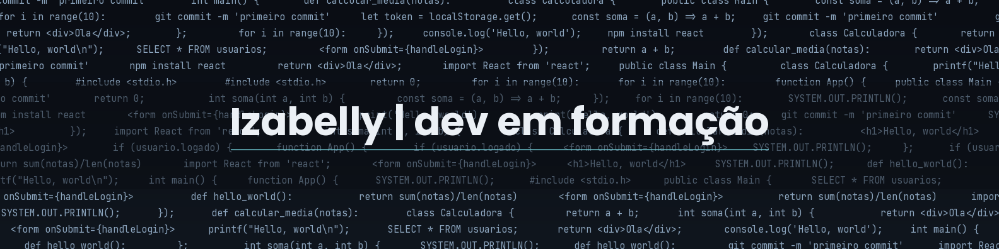

[README.md](https://github.com/user-attachments/files/31294612/README.md)

# Oi, eu sou a Izabelly 👋

🎓 Estudante de **Tecnólogo em Análise e Desenvolvimento de Sistemas** na Universidade Cruzeiro do Sul (UNICSUL) — previsão de conclusão em 2028

🤖 Atualmente cursando **Programação em IA Generativa** pelo SENAI

💻 Praticando lógica de programação e desenvolvimento web através de projetos pessoais

🌱 Aprendendo e evoluindo um pouco a cada dia

📫 Me encontre no [LinkedIn](https://www.linkedin.com/in/izabelly-sanches/)

---

### 🛠️ Tecnologias que venho praticando

### 📌 Projetos em destaque

- 🖥️ [Placar em React](https://github.com/izanamiivlr/placar-react) — aplicação de contagem de placar praticando componentização e estado
- 🔐 [Tela de Login (HTML/CSS)](https://github.com/izanamiivlr/meu-primeiro-site-html) — tela de login estilizada com identidade visual própria
- 🧮 [Calculadora em C](https://github.com/izanamiivlr/exercicio-calculadora-c) — exercício de lógica de programação
- 😴 [Study Report (Python)](https://github.com/izanamiivlr/study-report) — análise de horas de sono com variáveis e float

---

